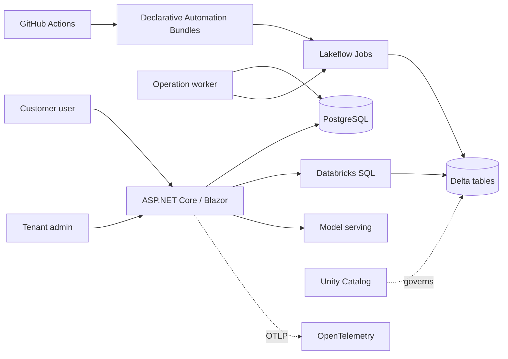

# Recommended architecture

## Locked premises

These are not options. Each is closed by primary-source evidence.

**The application tier runs outside Databricks.** Databricks Apps documentation states: "You can't
make Databricks apps public. Anonymous access and bypassing single sign-on (SSO) are not supported."
Every user must be an identity in your Databricks account, there are no custom domains, the ceiling
is 2-4 vCPU, and the runtime is Python 3.11 and Node 22.16 with no .NET and no container support.
Databricks Apps is the right host for internal tooling and the wrong host for customer-facing SaaS.

**Tenancy is enforced in the .NET query layer.** See `04-tenant-model.md`.

**Databricks REST access reuses `Microsoft.Azure.Databricks.Client`.** MIT, 2.2M downloads,
.NET 8/9/10, already covers Unity Catalog, Statement Execution and Jobs. We wrap it behind our own
interfaces so capabilities can be swapped, and we add only what is missing.

## The three planes

```
Application plane (.NET, hosted outside Databricks)
  ASP.NET Core  ->  OIDC  ->  TenantContext  ->  operation orchestration
                                              ->  PostgreSQL (transactional state)
                    |
                    | typed clients, OAuth, no long-lived secrets
                    v
Data plane (Databricks)
  Databricks SQL  ->  Delta tables        governed by Unity Catalog
  Lakeflow Jobs   ->  pipelines
  Model serving   ->  OpenAI-compatible endpoint

Delivery plane
  Declarative Automation Bundles  ->  jobs, pipelines, schemas, grants
  GitHub Actions                  ->  validate, deploy, smoke test
  OpenTelemetry                   ->  app traces; OTLP to MLflow for AI spans
```

## What lives where

| Concern | Home | Reason |
|---|---|---|
| Users, orgs, membership, subscriptions | PostgreSQL | Row-level writes with transactions. Databricks is not a transactional store. |
| Operation state and external run IDs | PostgreSQL | Must survive a .NET restart and be queryable in milliseconds. |
| Audit events | PostgreSQL, append-only | Needs to be writable synchronously with the action being audited. |
| Analytical queries | Databricks SQL | Where the data is and where the compute scales. |
| Long-running processing | Lakeflow Jobs | Minutes to hours, wrong shape for an HTTP request. |
| Cached analytical results | PostgreSQL, keyed by tenant and query hash | Avoids paying warehouse cost for a repeated dashboard load. |
| AI inference | Model serving | Optional module. |

## Transactional store: PostgreSQL, not Lakebase

Lakebase is Postgres and would work. It is not the default because contributors must be able to run
`docker run postgres` with no cloud account, and because Lakebase is beta on Azure, which is the
reference cloud. The EF Core model targets standard Postgres, so Lakebase remains a documented
deployment option rather than a fork. Revisit when Lakebase reaches GA on Azure.

## Asynchronous operations

`wait_timeout` on the Statement Execution API maxes at 50 seconds. Anything slower is asynchronous
whether we like it or not, so asynchrony is the default path rather than an escalation.

```
POST /analyses            -> insert operation row (Pending), return 202 + operation URL
worker: claim            -> SELECT ... FOR UPDATE SKIP LOCKED
worker: submit           -> Databricks run, with idempotency_token
worker: record run id    -> the crash-critical write
worker: poll             -> exponential backoff with jitter
worker: complete         -> store result reference, mark Succeeded
GET /operations/{id}     -> product-facing state, never a raw Databricks state
```

**The failure this design exists to prevent:** a worker that crashes between submitting to Databricks
and recording the run ID. Without a recorded ID the operation is orphaned, and the retry submits a
second run. Reconciliation closes it by re-submitting with the original `idempotency_token`, which returns the
run that token already started. This is the case the integration test suite covers, because it
is invisible to every happy-path test.

**Platform states are open-ended.** Databricks documents job run states as extensible. An exhaustive
`switch` over them is a future crash. Platform states map at the boundary into a closed internal
enum with an explicit `Unknown` arm that logs and treats the run as still running.

## Result handling

`INLINE` disposition hard-fails at 25 MiB and cancels the statement rather than truncating. The
default is `EXTERNAL_LINKS` with `ARROW_STREAM`.

Two details that are security-relevant rather than performance-relevant:

- The presigned result link must be fetched with the Authorization header **stripped**, or the
  Databricks token is sent to blob storage.
- Chunk fetching is destructive. The statement closes when the last chunk is read and there is no
  retry. Results expire one hour after success. The operation record therefore stores a reference to
  a materialised result, not a promise to re-read the statement.

## Authentication

No long-lived secrets in the reference deployment.

- **App to Databricks, on Azure:** the Container App's managed identity gets an Entra ID token, which
  Azure Databricks accepts directly as a bearer token. No Databricks secret, no federation policy.
- **CI to Databricks:** GitHub Actions OIDC through a Databricks federation policy. Limits are 20
  policies per service principal and 20 per account.
- **Users to app:** provider-neutral `AddOpenIdConnect`. Entra ID is one configured provider, not the
  architecture. Contributors run a container-based OIDC provider locally.

## Stack

| Layer | Choice | Trade-off accepted |
|---|---|---|
| Runtime | .NET 10 | None. |
| Frontend | Blazor Web App, Interactive Server, Static SSR for content | Smaller contributor pool and a thinner component ecosystem, in exchange for one language, a trivial auth story, and no Node toolchain in CI. |
| Multitenancy | Hand-rolled | Finbuckle.MultiTenant was the plan and was not taken: tenancy here resolves from the application database and hands out a `TenantContext` that only the resolver can construct, which is not the shape Finbuckle models. Roughly 200 lines, and the type-system guarantee in ADR 0002 depends on owning them. |
| Background work | `BackgroundService` + Postgres `FOR UPDATE SKIP LOCKED` | No Hangfire or MassTransit licensing exposure, no extra infrastructure, at the cost of writing the claim loop. The operation record is a domain entity we need regardless. |
| Local orchestration | .NET Aspire, optional | `docker compose up` plus `dotnet run` must always work. Aspire is a convenience layer, never the only path, or it becomes a contributor tax. |
| Testing | xUnit v3, Testcontainers, WireMock.Net | None significant. |

## System context


